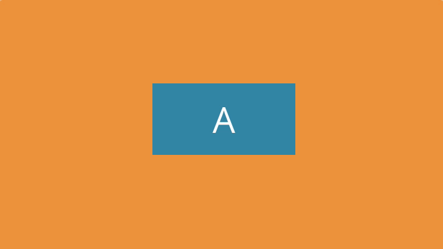
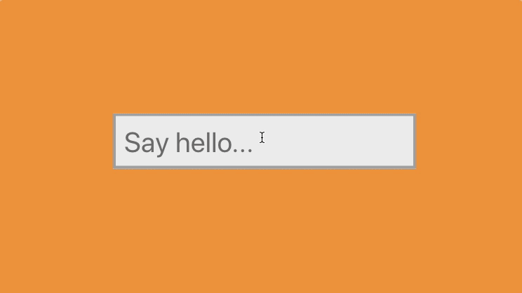

## Transitions - From A to B

The `transition` property is made up of four parts. 

```css
transition: transform 2s ease-out 1s;
```

What this transition means is "when any animatable property changes, wait for one second, then transition to the new style over a duration of 2 seconds". We'll go into timing functions in greater depth later.

The `ease-out` part of the definition, in this case, means to start fast and then gradually decelerate toward the end of the 2 seconds.

**Example 1:**

<center>
	
</center>

Code that do this:

```css
/* the blue container */
.demo-letter {
  left: 50%; 
  position: absolute; // A B这两个字母是absolute的位置
  top: 50%;
  // transition property and we want to affect the transform property
  transition: transform .4s ease-out; // 动画的启动对象
}

/* Container A */
.demo-letter1 {
  // 因为上面absolute x 的50%的位置过头了，所以要回来-50%
  -webkit-transform: translate(-50%, -50%); 
          transform: translate(-50%, -50%);  
}

/* Container B */
.demo-letter2 {
  -webkit-transform: translate(-50%, 200%); // B字母的y轴则在初始状态200%向上让他消失
          transform: translate(-50%, 200%);
}

/* Container A behavior when hover*/
.demo:hover .demo-letter1 {
  -webkit-transform: translate(-50%, -200%);
          transform: translate(-50%, -200%);
}

/* Container B behavior when hover*/
.demo:hover .demo-letter2 {
  -webkit-transform: translate(-50%, -50%);
          transform: translate(-50%, -50%);
}
```


**Example 2:**
<center>
	
</center>
Code:

```css
.demo-input {
  background: #eee;
  border: 4px solid #aaa;
  font-size: 4rem;
  padding: 1rem;
  -webkit-transition: border .2s ease-out, background .4s ease-out;
  //每一个property和他们对应各自的效果
  transition: border .2s ease-out, background .4s ease-out; 
}

.demo-input:focus {
  background: #fff;
  border: 4px solid #3991AE;
}

// Jquery控制，当输错时变红
.demo-input.invalid {
  border:4px solid red;
}

// Jquery控制，当正确时变绿
.demo-input.valid {
  border:4px solid green;
}
```


## Keyframes + Animation

While a transition might help us move one state to another, keyframes go further and give us a tool to create animations that go through as many different states as we need them to. Keyframe animations can also play automatically, this means they don't rely on a change of state.

```css
@keyframes mymove {
	0%   {top: 0px;}
	50%  {top: 100px;}
	100% {top: 0px;}
}
```

It starts with the `@keyframes` keyword, that tells us, and the browser, that we're creating a series of keyframes, followed by the name of this set of keyframes. Then, inside the outer most curly braces, we define our keyframes.

```css
div {
    animation: mymove 2s 1s ease-out forwards;
}
```

First we have the name (`mymove`) - this is the name we used for the keyframes earlier.

**animation-duration:**

Next we say how long an animation will run for; in this case 2 seconds, this is the **duration**.

**animation-delay:**

After we set the duration, we then specify **delay**. This means that the animation won't start straight away, but instead will wait one second before starting to run through the sequence of keyframes. We then specify a transition **timing-function**, in this case "ease-out". Again, we'll go into what these are all about later.

**animation-iteration-count:  animation-fill-mode:**

Lastly, we specify something called **"fill-mode"**. This is how we tell the browser, whether to revert to the original styles of the element after the animation has completed, or whether the end state of the keyframes, is the style we want to apply. This is set to "forwards", which means that we want the final keyframe, which is usually defined as 100%, to be the style that sticks around after the animation finishes.


## Timing:

- **animation-timing-function**
- First, we have "ease". Ease is the default, and it makes animations begin a little slowly, speed up, and then decelerate toward the end. It's a little like ease-in-out, except the ease-in part at the beginning of the movement is less pronounced.
- Next, we have "ease-in" and "ease-out". Ease-in is when an animation begins slowly and speeds up toward the end. Ease-out is the opposite; it starts fast and slows down toward the end. Combining these together, we have "ease-in-out". This both starts and ends slowly.
- Then we have "linear". This is the most computery of the animations. It moves from the beginning to the end in a robotic, unchanging pace.
- Then we have "steps". Steps is a function that breaks the animation into a series of discrete stages, with no tweening between each of the steps. Steps timing function lets you divide a transition into as many individual steps as needed. It's useful for stop-motion animations, like a cartoon, by being made up of individual frames put together to create the impression of movement. Twitter famously used this for the fave animation, in which they animated an image sprite made up of individual frames.
- Lastly, there's my favorite, cubic-bezier. Most of the timing-function presets are themselves cubic-bezier curves. A cubic-bezier curve is a curve made by defining two points. The curve represents the rate of change from the beginning to the end of the animation. We'll talk about this more, as there are tools we can use to create cubic-bezier curves to save doing the math by hand.